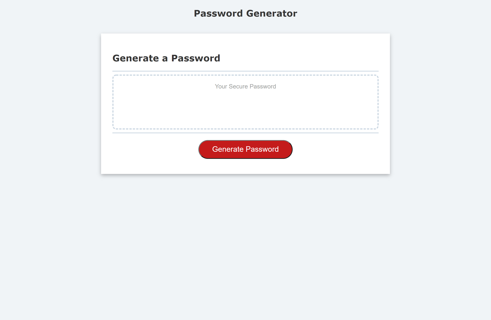

# hw3-password-generator

## My Task
    In this assignment my goal was to create a webpage that allows users to generate random passwords based on the criteria they select. This webpage was created using HTML, CSS, and JavaScript together. 

## Acceptance Criteria

- The webpage looks the same as the mock-up homework instructions
- The user can click the "Generate Password" button to go through the prompts for thier preferred password criteria.
- The user is given an alert if they did not choose to utilize any character type in their password and given the prompts all over again.
- The password result is displayed on the page after all prompts are answered. 

## Mock-Up

The following image shows the web page's appearance upon completion:
